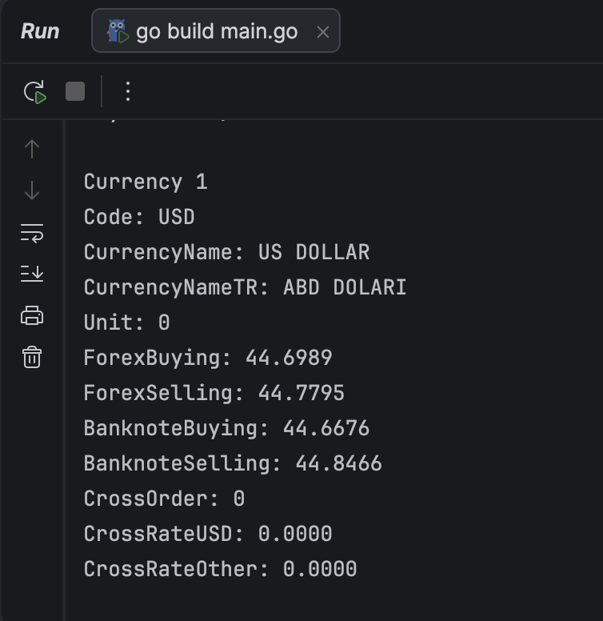
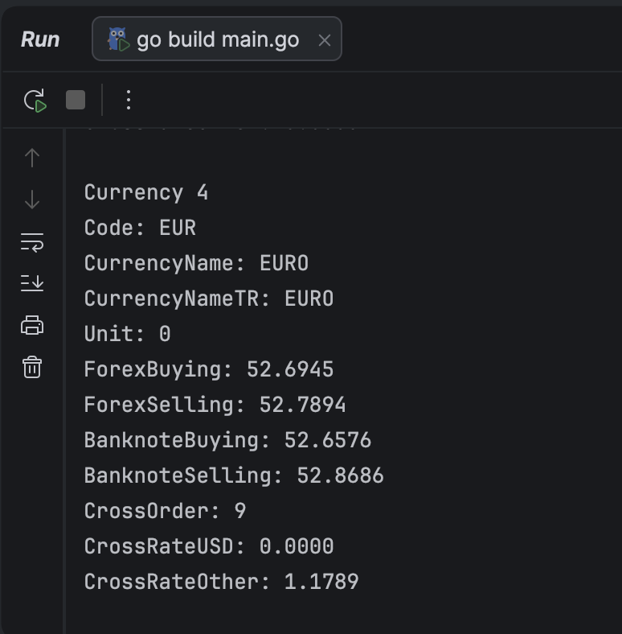

# TCMBCurrency

Bu proje, Türkiye Cumhuriyet Merkez Bankası (TCMB) tarafından yayınlanan günlük döviz kurlarını alır.

## Çalıştırma

```bash
go run .
```

## Ne Yapar?

- TCMB XML kur verisini çeker
- XML verisini ayrıştırır
- Sayısal string değerleri Go tiplerine dönüştürür
- Ayrıştırılan kur bilgilerini ekrana yazdırır

## Dosyalar

- `main.go`: ana uygulama mantığı
- `go.mod`: Go modül tanımı

## Çıktı Görselleri




