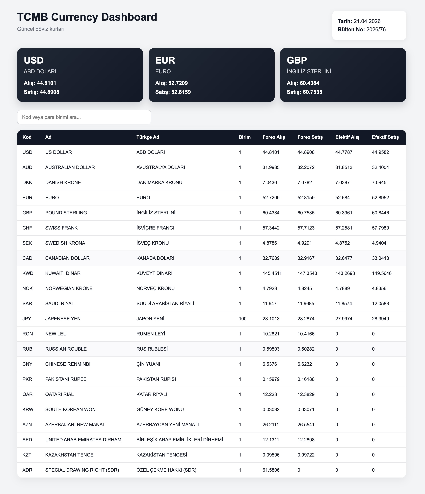

# TCBM Currency Dashboard

Türkiye Cumhuriyet Merkez Bankası (TCMB) döviz kurlarını anlık olarak
çeken ve kullanıcı dostu bir arayüzde sunan full-stack web uygulaması.

## Özellikler

-    Güncel döviz kurlarını görüntüleme
-    Arama ve filtreleme
-    USD, EUR, GBP için öne çıkan kartlar
-    Gerçek zamanlı veri (TCMB XML API)
-    REST API + React arayüz

------------------------------------------------------------------------
##  Ekran Görüntüsü

------------------------------------------------------------------------

## ️ Kullanılan Teknolojiler

### Backend (Go)

-   Go (Golang)
-   net/http
-   XML parsing (encoding/xml)

### Frontend (React)

-   React + Vite
-   Axios
-   CSS (custom styling)

------------------------------------------------------------------------

## Proje Mimarisi

    TCBMCurrency/
      internal/
        tcmb/        -> TCMB veri çekme ve parse işlemleri
        http/        -> API handler'lar

      frontend/
        React uygulaması

------------------------------------------------------------------------

##  API Endpointleri

### Sağlık kontrolü

GET /api/health

### Güncel döviz kurları

GET /api/currencies/today

------------------------------------------------------------------------

## ️ Kurulum ve Çalıştırma

### Backend

    go run .

### Frontend

    cd frontend
    npm install
    npm run dev

------------------------------------------------------------------------

## Veri Kaynağı

http://www.tcmb.gov.tr/kurlar/

